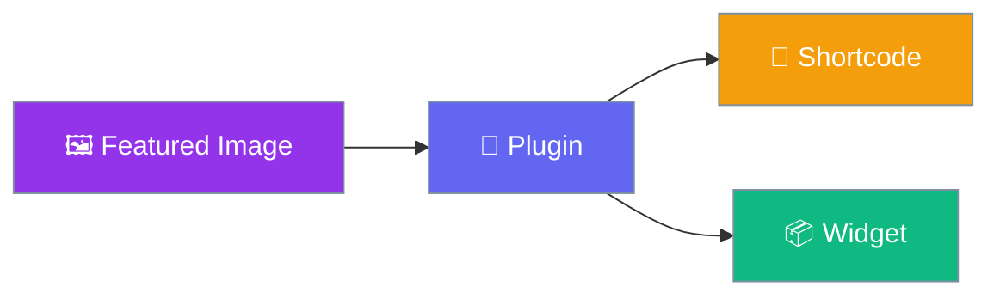

# Featured Image

Display featured images with shortcodes and widgets.

## Quick Start

1. **Install** → Upload plugin
2. **Use** → `[featured-img]` shortcode
3. **Done!** 🎉

## Features

| Feature | Description |
|---------|-------------|
| 🖼️ Shortcode | `[featured-img]` |
| 📝 Caption | `[featured-img-caption]` |
| 📦 Widget | Sidebar widget |

## Next Steps

- [Installation](getting-started/installation.md)
- [Usage Guide](getting-started/usage.md)
